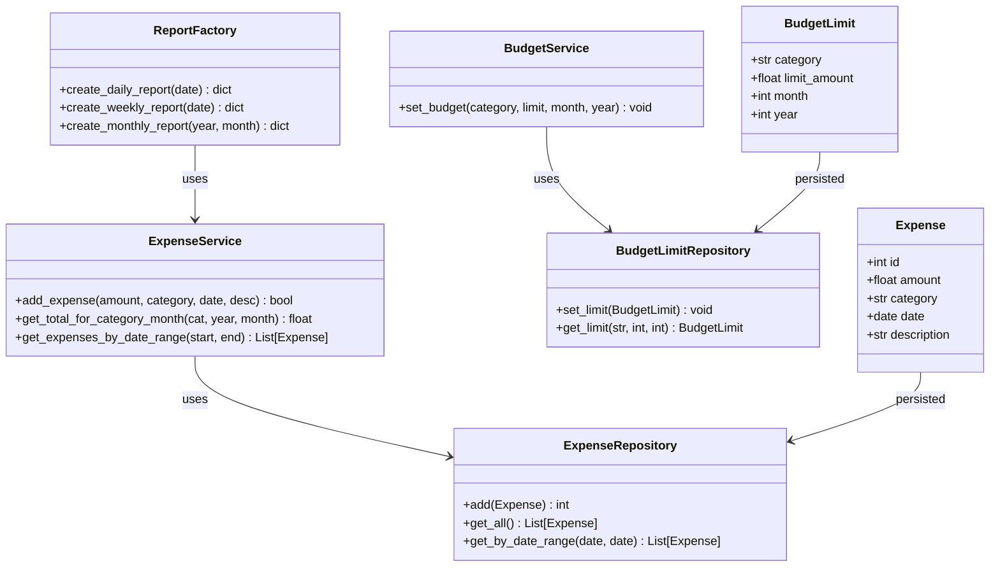
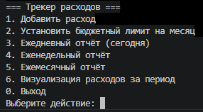
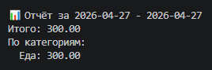
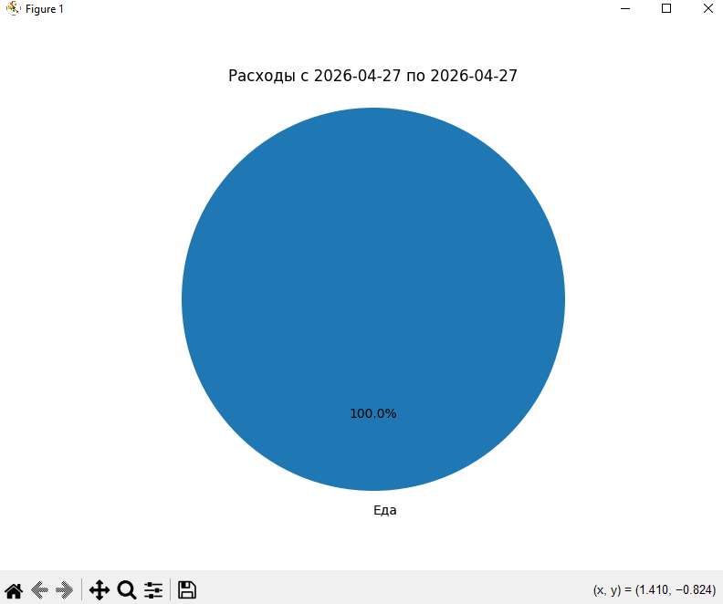

# Трекер расходов

Консольное приложение для учёта личных финансов с возможностью установки бюджетных лимитов, генерации отчётов и визуализации расходов.

## Функциональность
- Добавление расходов с указанием суммы, категории, даты и описания
- Категоризация расходов (произвольные названия)
- Установка месячных лимитов на категории
- Автоматическое предупреждение при превышении лимита
- Отчёты: ежедневный, еженедельный, ежемесячный
- Визуализация расходов по категориям (круговая диаграмма)

## Технологии
- Python 3.10+
- SQLite3 (встроенная)
- Matplotlib для графиков

## Архитектура
- **Модели** (`models.py`) – dataclasses для Expense, BudgetLimit
- **Репозитории** (`repositories.py`) – абстракция доступа к БД (паттерн Repository)
- **Сервисы** (`services.py`) – бизнес-логика, проверка лимитов
- **Фабрика отчётов** (`reports.py`) – создание отчётов разных типов
- **Визуализация** (`visualization.py`) – построение круговой диаграммы
- **CLI** (`cli.py`) – консольный интерфейс пользователя
- **Точка входа** (`main.py`) – инициализация БД и запуск

## Скриншоты работы приложения

